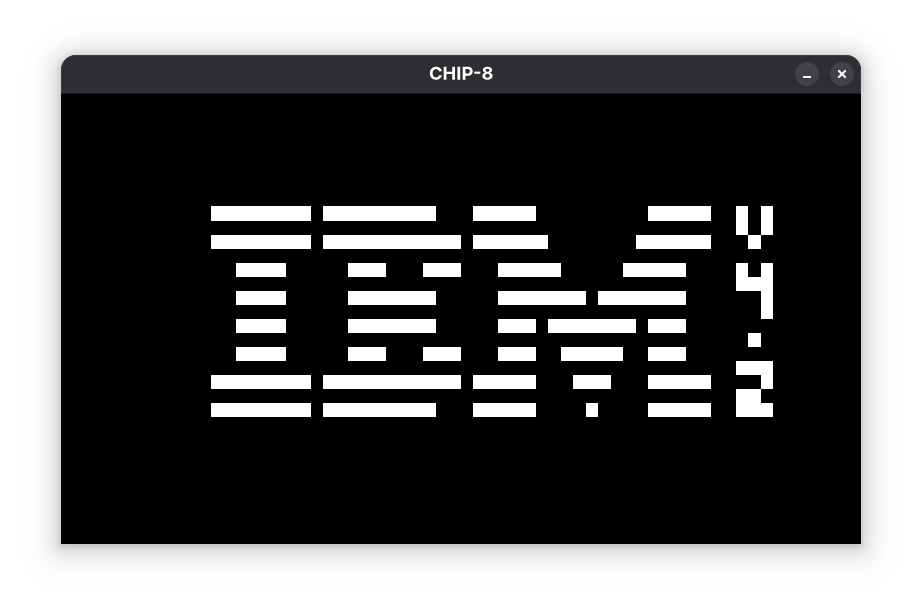
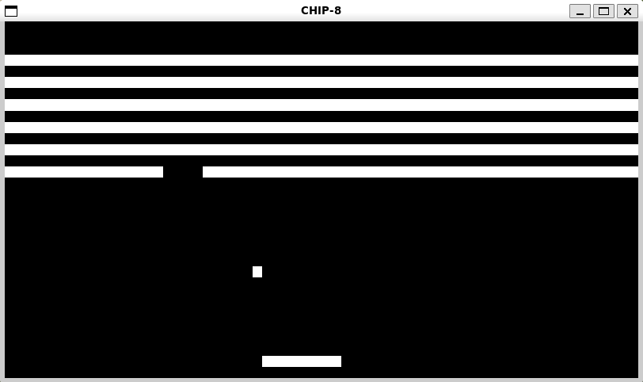

# CHIP-8 Emulator

Finally done... my CHIP-8 emulator written in C with [raylib](https://www.raylib.com/)

## Features
- 64×32 monochrome display rendered via raylib, scaled cleanly to a desktop window.
- Hex keypad mapping to the keyboard: `1 2 3 4`, `Q W E R`, `A S D F`, `Z X C V`.
- Configurable ROM loading from the command line and a helper script to generate the default beep sample.

## Getting Started
Prerequisites on Ubuntu/WSL:
- `raylib` development libraries
- `gcc`

## Run
```bash
make run ROM=assets/[ch8-filename]
```

## Screenshots



